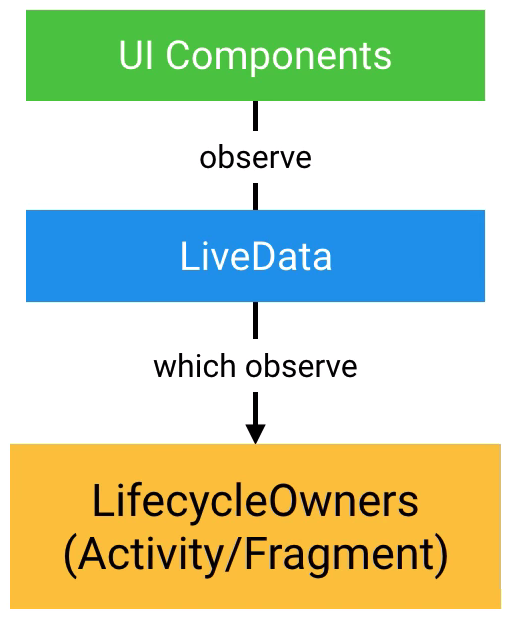

# [MVVM (Model–view–viewmodel)](https://android-developers.googleblog.com/2017/05/android-and-architecture.html)

**LiveData** is an observable data holder. It notifies observers when data changes so that you can update the UI. It is also **lifecycler aware**, a subclass of `LifecycleObserver`. LiveData will call setup and teardown functions automatically.

If LiveData is tied to the activity lifecycle, it will cause a lot of needlessly re-executing code. Example: your database query is executed every time you rotate the phone. The better choice is you put your LiveData associated with the UI in a ViewModel instead.

**ViewModel**s are objects that provide data for UI components and survive configuration changes. You can put all of the necessary data for your Activity UI into the ViewModel since you've cached data for the UI inside of the ViewModel your app won't require the database if your Activities recreated due to a configration change. Then when you creating your activity or fragment you can get a reference to the ViewModel and use it. The first time you get a ViewModel it's generated for your activity, when you request model again, your activity receives the original ViewModel with the UI data cached, so there is no more useless database calls.  

