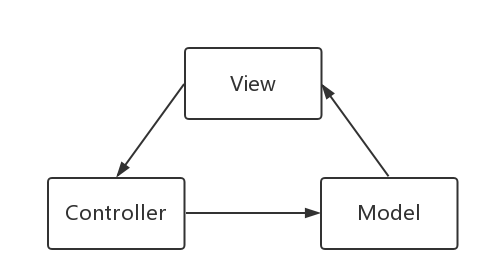
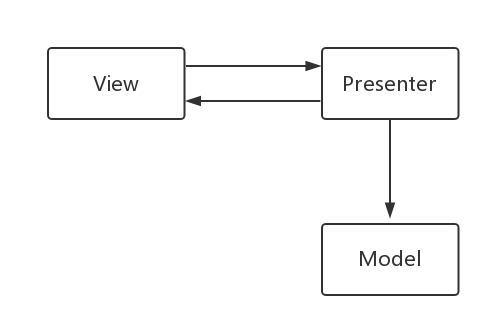

# [MVVM (Model–view–viewmodel)](https://android-developers.googleblog.com/2017/05/android-and-architecture.html)

**LiveData** is an observable data holder. It notifies observers when data changes so that you can update the UI. It is also **lifecycler aware**, a subclass of `LifecycleObserver`. LiveData will call setup and teardown functions automatically.


If LiveData is tied to the activity lifecycle, it will cause a lot of needlessly re-executing code. Example: your database query is executed every time you rotate the phone. The better choice is you put your LiveData associated with the UI in a ViewModel instead.

**ViewModel**s are objects that provide data for UI components and survive configuration changes. You can put all of the necessary data for your Activity UI into the ViewModel since you've cached data for the UI inside of the ViewModel your app won't require the database if your Activities recreated due to a configration change. Then when you creating your activity or fragment you can get a reference to the ViewModel and use it. The first time you get a ViewModel it's generated for your activity, when you request model again, your activity receives the original ViewModel with the UI data cached, so there is no more useless database calls.  


# MVC

MVC全名是Model View Controller，是模型(model)－视图(view)－控制器(controller)的缩写，是一种框架模式。



- Model：模型层，负责处理数据的加载或存储。
- View：视图层，负责界面数据的展示，与用户进行交互。(布局的XML文件)
- Controller：控制器层，负责逻辑业务的处理。(Activity)

一个模型可以有多个视图，一个视图可以有多个控制器，一个控制器也可以有多个模型。
Android中一般布局的XML文件就是View层，Activity则充当了Controller的角色。

下面举个简单的例子来实现，点击按钮对数字+1然后重新显示出来。

**Model层**

创建一个数据模型，能够保存一个数字，并有一个更新的方法，数据更新完后会通知UI去更改显示的内容。

```
public class NumModel {
    private int num = 0;

    public void add(ControllerActivity activity) {
        num = ++num;//更新数据
        activity.updateUI(num + "");//更新UI
    }
}
```

**View层**

View层在Android中对应的就是布局的XML文件。
activity_controller.xml ：

```
<?xml version="1.0" encoding="utf-8"?>
<LinearLayout xmlns:android="http://schemas.android.com/apk/res/android"
              android:layout_width="match_parent"
              android:layout_height="match_parent"
              android:orientation="vertical">

    <TextView
        android:id="@+id/tv_show"
        android:layout_width="wrap_content"
        android:layout_height="wrap_content"
        android:text="0"/>

    <Button
        android:id="@+id/btn_add"
        android:layout_width="wrap_content"
        android:layout_height="wrap_content"
        android:text="点击+1"/>
</LinearLayout>
```

**Controller层**

Android中一般由Activity来充当Controller。Controller一方面接收来自View的事件，一方面通知Model处理数据。

```
public class ControllerActivity extends Activity {

    private TextView mTextView;
    private Button mButton;
    private NumModel mNumModel;

    @Override
    protected void onCreate(Bundle savedInstanceState) {
        super.onCreate(savedInstanceState);
        setContentView(R.layout.activity_controller);

        mTextView = findViewById(R.id.tv_show);
        mButton = findViewById(R.id.btn_add);
        mNumModel = new NumModel();
        
        mButton.setOnClickListener(new View.OnClickListener() {//接收来自View的事件
            @Override
            public void onClick(View v) {
                mNumModel.add(ControllerActivity.this);//通知Model处理数据
            }
        });
    }

    public void updateUI(String text) {//更新UI
        mTextView.setText(text);
    }
}
```

Android 中最典型的 MVC 莫过于 `ListView` 了，要显示的数据为 Model，而要显示的`ListView`就是 View 了， `Adapter` 则充当着 Controller 的角色。当 Model 发生改变的时候可以通过调用 `Adapter` 的 `notifyDataSetChanged` 方法来通知组件数据发生变化，这时 `Adapter` 会调用 `getView` 方法重新显示内容。具体代码这里就不分析了。

**MVC的优点**

- 视图层（View）与模型层（Model）解偶，通过Controller来进行联系。
- 模块职责划分明确。主要划分层M,V,C三个模块，利于代码的维护。

**MVC的缺点**

- Android中使用了Activity来充当Controller，但实际上一些UI也是由Activity来控制的，比如进度条等。因此部分视图就会跟Controller捆绑在同一个类了。同时，由于Activity的职责过大，Activity类的代码也会迅速膨胀。
- MVC还有一个重要的缺陷就是View跟Model是有交互的，没有做到完全的分离，这就会产生耦合。

# MVP

MVP全名是Model－View－Presenter，MVP 是从经典的模式MVC演变而来的。

- Model：模型层，负责处理数据的加载或存储。与MVP中的M一样。
- View：视图层，负责界面数据的展示，与用户进行交互。与MVP中的V一样。
- Presenter：负责逻辑业务的处理。跟MVC中的C有所区别。

将Model与View彻底分离。
解决MVC中Activity职责过多，代码臃肿的问题。



1. View接受用户的请求，然后将请求传递给Presenter。
2. Presenter进行业务逻辑处理，修改Model。
3. Presenter通知View去更新界面显示。

**跟MVC不同的地方在于Model不会跟View发生交互，只会跟Presenter交互。**

**MVP的优点**

- View与Model完全分离，我们可以修改视图而不影响模型。
- 可以更高效地使用模型，因为所有的交互都发生Presenter中。
- Presenter与View的交互是通过接口来进行的，有利于添加单元测试。

**MVP存在的问题**

- 页面逻辑复杂的话，相应的**接口也会变多**，增加维护成本。可以定义一些基类去分离一些公共的逻辑。
- 系统内存不足时，系统会回收Activity。一般我们都是用OnSaveInstanceState()去保存状态，用OnRestoreInstanceState()去恢复状态。但是在我们的MVP中，View层是不应该去直接操作Model的，所以这样做不合理，同时也增大了M与V的耦合。解决办法是不要将Activity作为View层，可以把Activity当Presenter来处理。具体实现这里就不分析了，有兴趣的可以研究一下。
- UI改变的话，比如TextView 替换 EditText，可能导致Presente的一些更新UI的接口也跟着需要更改，存在一定的耦合。