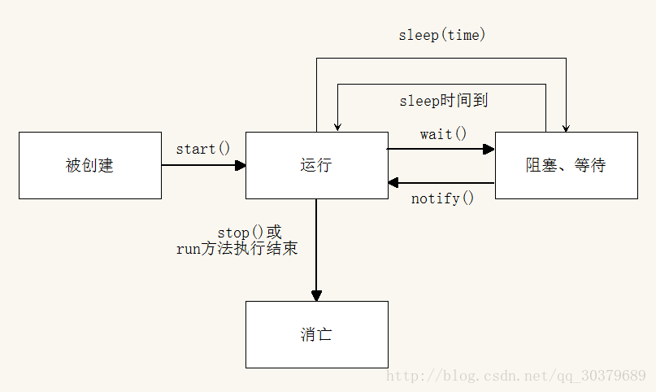

# *Handler, Thread, HandlerThread*

## Thread
### Create Thread
There are two ways to create a new thread of execution. One is to
declare a class to be a subclass of <code>Thread</code>. This
subclass should override the <code>run</code> method of class
<code>Thread</code>. An instance of the subclass can then be
allocated and started. For example, a thread that computes primes
larger than a stated value could be written as follows:

<blockquote><pre>
    class PrimeThread extends Thread {
        long minPrime;
        PrimeThread(long minPrime) {
            this.minPrime = minPrime;
        }
        public void run() {
            // compute primes larger than minPrime
            &nbsp;.&nbsp;.&nbsp;.
        }
    }
</pre></blockquote>
<p>
The following code would then create a thread and start it running:
<blockquote><pre>
    PrimeThread p = new PrimeThread(143);
    p.start();
</pre></blockquote>
<p><hr>
The other way to create a thread is to declare a class that
implements the <code>Runnable</code> interface. That class then
implements the <code>run</code> method. An instance of the class can
then be allocated, passed as an argument when creating
<code>Thread</code>, and started. The same example in this other
style looks like the following:
<blockquote><pre>
    class PrimeRun implements Runnable {
        long minPrime;
        PrimeRun(long minPrime) {
            this.minPrime = minPrime;
        }
        public void run() {
            // compute primes larger than minPrime
            &nbsp;.&nbsp;.&nbsp;.
        }
    }
</pre></blockquote>
<p>
The following code would then create a thread and start it running:
<blockquote><pre>
    PrimeRun p = new PrimeRun(143);
    new Thread(p).start();
</pre></blockquote>

### Lifecycle


### wait()、notify()、notifyAll()
wait、notify、notifyAll都必须在synchronized中执行，否则会抛出异常。android 官方不推荐使用。
wait: 进入阻塞状态，释放锁（其它线程可以进入synchronized方法体或方法块，释放锁不需要try/catch）. Causes the current thread to wait until another thread invokes the notify() method or the notifyAll() method for this object. 

Java多线程面试题：子线程循环10次，接着主线程循环15次，接着又回到子线程循环10次，接着再回到主线程又循环15次，如此循环50次

```
private static Object lock = new Object();

public static void main(String[] args) {
    //子线程
    new Thread() {
        @Override
        public void run() {
            for (int i = 0; i < 50; i++) {
                synchronized (lock){
                    for (int j = 0; j < 10; j++) {
                        System.out.println("i = " + i + "子循环循环第" + (j + 1) + "次");
                    }
                    //唤醒【等待唤醒队列】的第一个线程
                    lock.notify();
                    //等待
                    try {
                        // 代表子线程等待，让出使用权让主线程执行，
                        // 这个时候子线程等待这一事件会被加进到【等待唤醒队列】中。
                        lock.wait();
                    } catch (InterruptedException e) {
                        e.printStackTrace();
                    }
                }
            }
        }
    }.start();

    //主线程
    for (int i = 0; i < 50; i++) {
        synchronized (lock){
            try {
                // 代表主线程等待，让出使用权让子线程执行，
                // 这个时候主线程等待这一事件会被加进到【等待唤醒队列】中。
                lock.wait(); 
            } catch (InterruptedException e) {
                e.printStackTrace();
            }

            for (int j = 0; j < 15; j++) {
                System.out.println("i = " + i + "主循环循环第" + (j + 1) + "次");
            }
            //唤醒【等待唤醒队列】的第一个线程
            lock.notify();
        }
    }
}
```
### sleep()、join()、yield()
#### 1. sleep()
线程休眠，进入阻塞状态，sleep方法不会释放锁（其它线程不会进入synchronized方法体或方法块，不释放锁需要try/catch）

```
try {
    Thread.sleep(2000);
} catch (InterruptedException e) {
    e.printStackTrace();
}
```

#### 2. join()
线程插队，join()作用是让指定的线程先执行完再执行其他线程，而且会阻塞主线程，它的使用也很简单

```
public class JoinActivity extends AppCompatActivity {

    @Override
    protected void onCreate(Bundle savedInstanceState) {
        super.onCreate(savedInstanceState);
        setContentView(R.layout.activity_join);

        //启动线程一
        try {
            MyThread myThread1 = new MyThread("线程一");
            myThread1.start();
            myThread1.join(); // 会block主线程
        } catch (InterruptedException e) {
            e.printStackTrace();
        }

        System.out.println("主线程需要等待");

        //启动线程二
        try {
            MyThread myThread2 = new MyThread("线程二");
            myThread2.start();
            myThread2.join(); // 会block主线程
        } catch (InterruptedException e) {
            e.printStackTrace();
        }

        System.out.println("主线程继续执行");
    }

    class MyThread extends Thread {

        public MyThread(String name) {
            super(name);
        }

        @Override
        public void run() {
            System.out.println(getName() + "在运行");
            try {
                Thread.sleep(2000);
            } catch (InterruptedException e) {
                e.printStackTrace();
            }
        }
    }
}
```

#### 3. yield()
yield()的作用是指定线程先让别的线程的先执行，就好比公交车只有一个座位，谁礼让了谁就坐上去。特别注意的是：yield()会礼让给相同优先级的或者是优先级更高的线程执行，不过yield()这个方法只是把线程的执行状态打回准备就绪状态，所以执行了该方法后，有可能马上又开始运行，有可能等待很长时间。
线程交出CPU，但是不会阻塞而是重置为就绪状态，**不会释放锁**

```
public static void main(String[] args) {
    MyThread myThread1 = new MyThread("线程一");
    MyThread myThread2 = new MyThread("线程二");

    myThread1.start();
    myThread2.start();
}

static class MyThread extends Thread {

    public MyThread(String name) {
        super(name);
    }

    @Override
    public synchronized void run() {
        for (int i = 0; i < 100; i++) {
            System.out.println(getName() + "在运行，i的值为：" + i + " 优先级为：" + getPriority());
            if (i == 2) {
                System.out.println(getName() + "yield");
                Thread.yield();
                try {
                    Thread.sleep(1000);
                } catch (InterruptedException e) {
                    e.printStackTrace();
                }
            }
        }
    }
}
```
[Android进阶——多线程系列之Thread、Runnable、Callable、Future、FutureTask](https://blog.csdn.net/qq_30379689/article/details/53819815)

[Android进阶——多线程系列之四大线程池的使用介绍](https://blog.csdn.net/qq_30379689/article/details/53522085)

## Handler
A Handler allows you to send and process <code>Message</code> and <code>Runnable</code>
objects associated with a thread's MessageQueue.  **Each Handler
instance is associated with a single thread and that thread's message
queue.**  When you create a new Handler, it is bound to the thread /
message queue of the thread that is creating it -- from that point on,
it will deliver messages and runnables to that message queue and execute
them as they come out of the message queue.

<p>There are two main uses for a Handler: (1) to schedule messages and
runnables to be executed as some point in the future; and (2) to enqueue
an action to be performed on a different thread than your own.

<p>Scheduling messages is accomplished with the
<code>post</code>, <code>postAtTime(Runnable, long)</code>,
<code>postDelayed</code>, <code>sendEmptyMessage</code>,
<code>sendMessage</code>, <code>sendMessageAtTime</code>, and
<code>sendMessageDelayed</code> methods.  The <em>post</em> versions allow
you to enqueue Runnable objects to be called by the message queue when
they are received; the <em>sendMessage</em> versions allow you to enqueue
a <code>Message</code> object containing a bundle of data that will be
processed by the Handler's <code>handleMessage</code> method (requiring that
you implement a subclass of Handler).


Handler是Android中引入的一种让开发者参与处理线程中消息循环的机制。每个Hanlder都关联了一个线程，每个线程内部都维护了一个消息队列MessageQueue，这样Handler实际上也就关联了一个消息队列。可以通过Handler将Message和Runnable对象发送到该Handler所关联线程的MessageQueue（消息队列）中，然后该消息队列一直在循环拿出一个Message，对其进行处理，处理完之后拿出下一个Message，继续进行处理，周而复始。当创建一个Handler的时候，该Handler就绑定了当前创建Hanlder的线程。从这时起，该Hanlder就可以发送Message和Runnable对象到该Handler对应的消息队列中，当从MessageQueue取出某个Message时，会让Handler对其进行处理。

## Looper
Class used to run a message loop for a thread.  
除了UI线程/主线程以外，普通的线程(先不提HandlerThread)是不自带Looper的。想要通过UI线程与子线程通信需要在子线程内自己实现一个Looper。开启Looper分三步走：

1. 判定是否已有Looper并Looper.prepare()
2. 做一些准备工作(如暴露handler等)
3. 调用Looper.loop()，线程进入阻塞态

<p>a typical example of the implementation of a Looper thread,
using the separation of `prepare` and `loop` to create an
initial Handler to communicate with the Looper.

<pre>
class LooperThread extends Thread {
    public Handler mHandler;

    public void run() {
        Looper.prepare(); // create a messageQueue and set thread to currentThread, 每个thread只能跑一次

        mHandler = new Handler() {
            public void handleMessage(Message msg) {
                // process incoming messages here
            }
        };

        Looper.loop();
    }
}</pre>

由于每一个线程内最多只可以有一个`Looper`，所以一定要在`Looper.prepare()`之前做好判定，否则会抛出`java.lang.RuntimeException: Only one Looper may be created per thread`。为了获取`Looper`的信息可以使用两个方法：

* `Looper.myLooper()`
* `Looper.getMainLooper()`

`Looper.myLooper()`获取当前线程绑定的`Looper`，如果没有返回`null`。`Looper.getMainLooper()`返回主线程的`Looper`,这样就可以方便的与主线程通信。注意：在`Thread`的构造函数中调用`Looper.myLooper`只会得到主线程的`Looper`，因为此时新线程还未构造好

