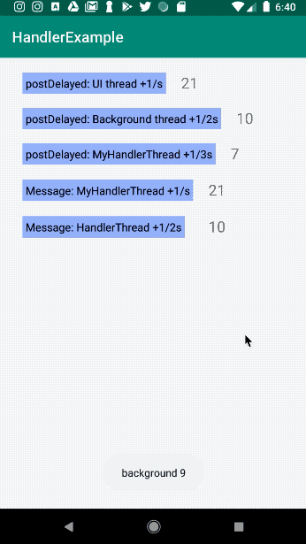
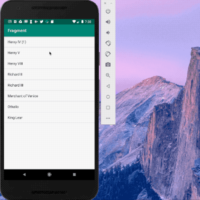

Some examples of:

* #### Handler, Thread, HandlerThread
  

* #### Android Draw View
  
  
* #### Fragment
  
  
* #### AsyncTask
  
  
* #### AsyncTaskLoader
  Example at: [link](https://github.com/ydxb7/Exercises_Java/tree/master/Lesson05b-Smarter-GitHub-Repo-Search)
  
  处理AsyncTask 的 edge case: 正在下载的时候旋转屏幕，得到的result会传递给一个已经不存在的activity。使用LoaderManager的Loader，他们的生命超过activity的生命周期来避免重复加载。如果我们需要在background thread load data，使用AsyncTaskLoader
  

	1. **SaveResults** - 旋转设备后保存搜索结果
	2. **AsyncTaskLoader 的使用** - 把AsyncTask改成`AsyncTaskLoader`，只处理旋转的加载问题，但是如果用户离开再回来就会重新加载，用3来处理这个问题。使用 `AsyncTaskLoader` 后就不需要用 onSaveInstanceState 记录的结果
	3. **PolishAsyncTask** - 缓存加载器结果，防止客户离开应用后出现查询

* #### Network
  