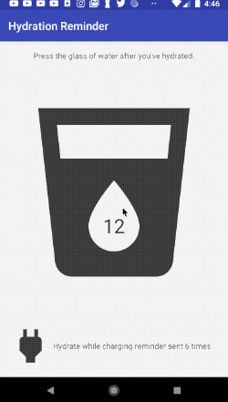

# Service

**如果要加载用于界面的内容，用Loader。如果处理的内容与界面无关就用service**

Learn how to use Service and send notifications and schedule the job work in background.

3 ways to start a service:

* **manually start a service**: 通常处理service后**不会** communicate back to 开启他的组件。例如用service发送邮件，发完就不通知你了。
* **schedule a service**: **JobService** 会在满足一定条件后自动开启（充电情况，时间...）。 
* **bind to the service**: 使用`bindService()`, **会** communicate back to 开启他的组件. 例如用 service 播放音乐，希望界面根据音乐播放的情况显示相关内容（已经播放的时间），页希望通过按钮控制service。

android 所有的 component（Services, Activity, Content Provider, Broadcast Receiver） 开启的时候都是在主线程上的，所以在 service 里要自己在background thread上完成。

Service 也有自己的 lifecycle:

1. `onCreate()`
2. `onStartCommand()` -> 开始你希望service处理的工作
3. Service Running -> start the AsyncTask here
4. service 结束后，我们自己调用 `stopSelf()`, 会触发 `onDestroy()`
5. `onDestroy()`

## IntentService

IntentService 是一种单独在 background thread 上运行的 service。所有 intent service requests 都是在同一个background thread中处理的，并且是按顺序发出的, 适用于一些应该按顺序处理的任务。

```
public class MyIntentService extends IntentService {

    //  Create a default constructor that calls super with the name of this class
    public MyIntentService() {
        super("MyIntentService");
    }

    @Override
    protected void onHandleIntent(Intent intent) {
    	  // do whatever you want in the background
    	  ...
    }
}
```
```
Intent myIntentService = new Intent(this, MyIntentService);
startService(myIntentService);
```

Example: [link](https://github.com/ydxb7/Exercises_Java/tree/master/Lesson10-Hydration-Reminder) 

点击图片水量+1，这个例子里有简单的 preference 和 OnSharedPreferenceChangeListener 的操作



## PendingIntents
让别的app像你的app一样，使用用你的app（经过permission的）中的操作例如: 使用 services, private activities, broadcast protected intents.

使用下面的static method，创建 PendingIntent instance:
`getActivity(Context, int, Intent, int)`, `getActivities(Context, int, Intent[], int)`, `getBroadcast(Context, int, Intent, int)`, and `getService(Context, int, Intent, int)`.

```
private static PendingIntent contentIntent(Context context) {
    // Create an intent that opens up the MainActivity
    Intent startActivityIntent = new Intent(context, MainActivity.class);
    return PendingIntent.getActivity(
    		context, 
    		PENDING_INTENT_ID, 
			startActivityIntent, 
			PendingIntent.FLAG_CANCEL_CURRENT);
    }
```

## Notification

[简单例子](https://github.com/ydxb7/Exercises_Java/tree/master/Lesson10-Hydration-Reminder/T10.02-Exercise-CreateNotification)：点击按钮弹出notification。


