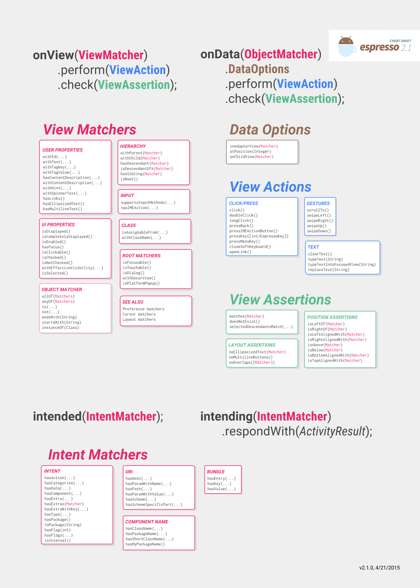

# Test Espresso



1. Find the view

   `ViewMatcher`: 
   `onView(withId(R.id.order_button)`

2. Perform action on the view

  `.perform(ViewAction)`: `.perform(click())`

3. Check if the view does what you expected

  `ViewAssertion`: `onView(withId(R.id.order_summary_text).check(isDisplayed())`

[Example](https://github.com/ydxb7/Exercises_Java/tree/master/Advanced-Lesson07-TeaTime-EspressoUITest/01-Exercise-FinishOrderActivityBasicTest):

```
// AndroidJUnit4 is a class which will help us control launch the app as well as running UI tests on it.
@RunWith(AndroidJUnit4.class)
public class OrderActivityBasicTest {

    // Add the rule that provides functional testing of a single activity
    @Rule public ActivityTestRule<OrderActivity> mActivityTestRule
            = new ActivityTestRule<>(OrderActivity.class);
	@Test
    public void clickDecrementButton_ChangesQuantityAndCost() {
    	// - Check that the initial quantity is zero
        onView(withId(R.id.quantity_text_view)).check(matches(withText("0")));

		// - Click on the decrement button
        onView(withId(R.id.decrement_button)).perform(click());
        
		// - Verify that the decrement button won't decrease the quantity 0 and cost below $0.00
        onView(withId(R.id.quantity_text_view)).check(matches(withText("0")));
        onView(withId(R.id.cost_text_view)).check(matches(withText("$0.00")));
    }

    @Test
    public void clickIncrementButton_ChangesQuantityAndCost(){
        // 1. Find the view
        // 2. Perform action on the view
        onView(withId(R.id.increment_button)).perform(click());
        // 3. Check if the view does what you expected
        onView(withId(R.id.quantity_text_view)).check(matches(withText("1")));
        onView(withId(R.id.cost_text_view)).check(matches(withText("$5.00")));
    }
}
```

[Example](https://github.com/ydxb7/Exercises_Java/tree/master/Advanced-Lesson07-TeaTime-EspressoUITest/02-Exercise-AddMenuActivityScreenTest): click on a **gridView** Tea item and verify that the OrderActivity opens up with the correct tea name displayed.

```
@RunWith(AndroidJUnit4.class)
public class MenuActivityScreenTest {

    public static final String TEA_NAME = "Green Tea";

    @Rule
    public ActivityTestRule<MenuActivity> mActivityTestRule =
            new ActivityTestRule<>(MenuActivity.class);

    @Test
    public void clickGridViewItem_OpensOrderActivity() {
        // Uses onData to get a reference to a specific gridview item and clicks it.
        onData(anything()).inAdapterView(withId(R.id.tea_grid_view)).atPosition(1).perform(click());

        // Checks that the OrderActivity opens with the correct tea name displayed
        onView(withId(R.id.tea_name_text_view)).check(matches(withText(TEA_NAME)));
    }
}
```

## Intent Testing
1. Intent Stub: A small piece of code that acts as a fake response to an intent call during a test. 验证从别的 activity 得到的信息。假设要从联系人里得到一个电话号，不需要实际从联系人里得到一个号码，就可以用 Intent Stub 生成一个假的电话号，便于测试.
  
  `intending(Matcher<Intent> matcher)`

2. Intent Verification: Using a hardcoded matcher to verify that the information we intended to send in an intent is what wes actually sent. 验证我们发送给别的 activity 的信息

  `intended(Matcher<Intent> matcher, VerificationMode verification)`
  
[Example](https://classroom.udacity.com/courses/ud855/lessons/f0084cc7-2cbc-4b8e-8644-375e8c927167/concepts/f0c53eb6-722d-4558-b317-d4205dc7822d): [IntentBasicSample 代码](https://github.com/googlesamples/android-testing/tree/master/ui/espresso/IntentsBasicSample)

测试从 OrderSummaryActivity 发送的电子邮件 intent。

```
@RunWith(AndroidJUnit4.class)
public class OrderSummaryActivityTest {

    private static final String emailMessage = "I just ordered a delicious tea from TeaTime. Next time you are craving a tea, check them out!";

    // Add the rule that indicates we want to use Espresso-Intents APIs in functional UI tests
    @Rule
    public IntentsTestRule<OrderSummaryActivity> mActivityRule = new IntentsTestRule<>(
            OrderSummaryActivity.class);

    // runs before each test and will stub all external intents so all external intents will be blocked
    @Before
    public void stubAllExternalIntents() {
        // By default Espresso Intents does not stub any Intents.  Stubbing needs to be setup before
        // every test run. In this case all external Intents will be blocked.
        // not(isInternal()) 检查该 intent 的软件包是否与测试的目标软件包不匹配。如果不匹配，则做出以下响应：
        intending(not(isInternal())).respondWith(new Instrumentation.ActivityResult(Activity.RESULT_OK, null));
    }

    // verifies that the intent sent by clicking the send email button matches the intent sent by the application
    @Test
    public void clickSendEmailButton_SendsEmail() {
        onView(withId(R.id.send_email_button)).perform(click());
        // intended(Matcher<Intent> matcher) asserts the given matcher matches one and only one
        // intent sent by the application.
        intended(allOf(
                hasAction(Intent.ACTION_SENDTO),
                hasExtra(Intent.EXTRA_TEXT, emailMessage)));
    }
}
```

## Idling Resources

[IdlingResourceSample](https://github.com/googlesamples/android-testing/tree/master/ui/espresso/IdlingResourceSample) 

[Udacity 讲解](https://classroom.udacity.com/courses/ud855/lessons/f0084cc7-2cbc-4b8e-8644-375e8c927167/concepts/d08f4f11-b8ff-4913-9766-5fb610a59de7)

If there is a process running on the main thread, and then some background work happens. Espresso waits until the app is idle before it continues to run the test. Idel: the divice isn't doing anything.(No UI events in the current message queue. No more tasks in the default AsyncTask thread pool.)

例如测试在 background 连接网络获取信息，需要处理时间。如果设置了 idling resources，那么在 AsyncTask 开始时 Espresso 将暂停测试，知道后台任务结束。


We also need `SimpleIdlingResource` and `idlingResource.setIdleState(true)` in non-test code.

```
@RunWith(AndroidJUnit4.class)
@LargeTest
public class IdlingResourceMenuActivityTest {

    /**
     * The ActivityTestRule is a rule provided by Android used for functional testing of a single
     * activity. The activity that will be tested, MenuActivity in this case, will be launched
     * before each test that's annotated with @Test and before methods annotated with @Before.
     *
     * The activity will be terminated after the test and methods annotated with @After are
     * complete. This rule allows you to directly access the activity during the test.
     */
    @Rule
    public ActivityTestRule<MenuActivity> mActivityTestRule =
            new ActivityTestRule<>(MenuActivity.class);

    private IdlingResource mIdlingResource;


    // Registers any resource that needs to be synchronized with Espresso before the test is run.
    @Before
    public void registerIdlingResource() {
        mIdlingResource = mActivityTestRule.getActivity().getIdlingResource();
        // To prove that the test fails, omit this call:
        Espresso.registerIdlingResources(mIdlingResource);
    }

    // Test that the gridView with Tea objects appears and we can click a gridView item
    @Test
    public void idlingResourceTest() {
        onData(anything()).inAdapterView(withId(R.id.tea_grid_view)).atPosition(0).perform(click());
    }

    // Unregister resources when not needed to avoid malfunction
    @After
    public void unregisterIdlingResource() {
        if (mIdlingResource != null) {
            Espresso.unregisterIdlingResources(mIdlingResource);
        }
    }
}
```

## Espresso Web 

[Example](https://github.com/googlesamples/android-testing/tree/master/ui/espresso/WebBasicSample)

## Espresso RecylcerView 测试